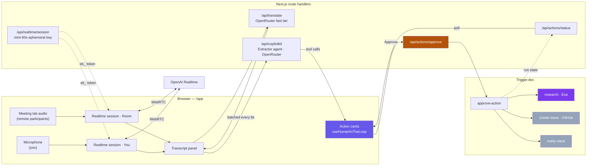
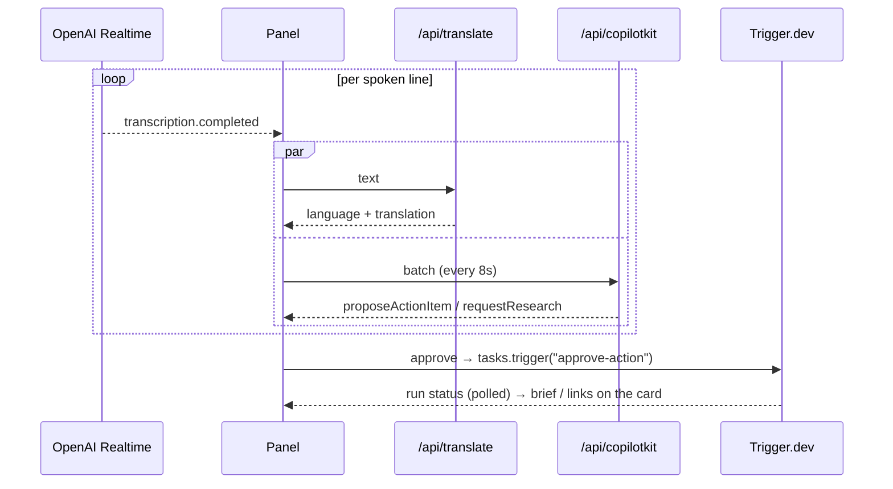

# OmniSync

A companion panel for cross-border meetings. It sits beside Google Meet, Zoom or Teams, transcribes everyone in the call in real time, translates as it goes, and turns spoken commitments into action cards a person can approve. Approved cards run in the background and report back while the call is still going.

## What it does today

| Capability | Status | Where |
|---|---|---|
| Sign in (Auth0, Google) | Working | `src/app/api/auth`, `src/lib/auth0.ts` |
| Consent gate before any capture | Working | `src/components/meeting/consent-gate.tsx` |
| Live transcription of the meeting tab **and** your mic | Working | `src/hooks/useMeetingCapture.ts`, `src/app/api/realtime/session` |
| Speaker tagging (You / Room) | Working | derived from the audio source |
| Per-line language detection and translation | Working | `src/app/api/translate` |
| Action-item and research extraction | Working | `src/app/api/copilotkit`, `src/lib/copilot-runtime.ts` |
| Approve / edit / dismiss cards (CopilotKit generative UI) | Working | `src/components/meeting/action-cards.tsx` |
| Background research via Exa, summarised into a brief | Working | `src/trigger/follow-up.ts` |
| Live run status back onto the card | Working | `src/app/api/actions/status` |
| Scripted sample meeting for demos | Working | `src/lib/sample-transcript.ts` |
| Meeting persistence (Prisma / Neon) | Schema in place, not yet wired to the live panel | `prisma/schema.prisma`, `src/app/api/meetings` |

Nothing from the live panel is written to disk. The transcript lives in the browser tab and is gone when the tab closes.

## Architecture



Three rules hold the design together:

- **Audio never touches the server.** Next only mints a short-lived key; the browser talks to OpenAI directly over WebRTC.
- **The extractor proposes, it never executes.** The agent can only call `proposeActionItem` or `requestResearch`. A person clicks Approve before anything leaves the meeting.
- **`/api/actions/approve` is the only path to Trigger.dev.** Every side effect passes through that one gate.

### Live loop



## Pending integrations

Both tasks exist in `src/trigger/follow-up.ts` and are called by `approve-action`; they throw a clear error until their variables are set.

### GitHub — pending
- Set `GITHUB_TOKEN` (fine-grained PAT with **Issues: write** on the target repo) and `GITHUB_REPO` (`owner/repo`).
- `create-issue` posts to `POST /repos/{owner}/{repo}/issues` and returns the issue URL to the card.
- Later: replace the PAT with per-user GitHub OAuth so issues are attributed to the approver.

### Slack — pending
- Create an **Incoming Webhook** on a Slack app and set `SLACK_WEBHOOK_URL`.
- `notify-slack` posts the research brief or the new action item with its issue link.
- Later: Slack OAuth + channel picker instead of a single webhook.

### Jira — not started
- No task yet. Would mirror `create-issue` against `POST /rest/api/3/issue` with an Atlassian API token, plus `JIRA_BASE_URL`, `JIRA_EMAIL`, `JIRA_API_TOKEN`, `JIRA_PROJECT_KEY`.

## Running it

```bash
cp .env.example .env        # fill in keys — each block links to where to get it
npm install
npx prisma generate
npm run dev                 # http://localhost:3000

# second terminal — required for approvals to run
npx trigger.dev@latest login
npx trigger.dev@latest dev
```

Then sign in, open `/app`, accept the consent gate, and either **Connect to meeting** (pick a **Chrome Tab** and tick *Share tab audio* — window and screen shares carry no audio on macOS) or **Sample** to replay the scripted meeting. Wear headphones, otherwise your mic re-records the remote side and every line transcribes twice.

`OPENAI_TRANSCRIBE_MODEL` defaults to `gpt-4o-transcribe`. Set it to `gpt-4o-transcribe-diarize` if your OpenAI org has access — that adds per-speaker labels inside the Room stream.

## Scripts

| Command | Purpose |
|---|---|
| `npm run dev` | Next dev server |
| `npm run build` | Production build |
| `npm run typecheck` | `tsc --noEmit` |
| `npm run lint` | ESLint |
| `npm run db:migrate` / `db:push` / `db:studio` | Prisma |
| `npm run test:e2e` | Playwright |
